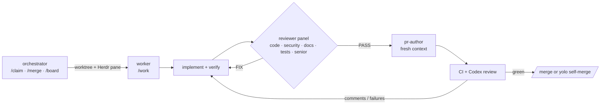

# workflows

Claude Code plugins for high-throughput, low-token, security-conscious development with AI agents. One orchestrator session claims GitHub issues into isolated worktree sessions; each worker implements, passes an independent reviewer panel, opens a PR from a fresh context, and drives CI and review comments to green.



## Plugins

| Plugin | What it gives you | Runs where |
| --- | --- | --- |
| [orchestrator](plugins/orchestrator/README.md) | `/claim`, `/yolo-claim`, `/merge`, `/board`, `/abandon`, `/herdr` | main checkout, inside [Herdr](https://herdr.dev) |
| [worker](plugins/worker/README.md) | `/work` pipeline, five read-only reviewer agents, fresh-context PR author, CI and review-thread loop, SessionStart hook that loads and assigns the issue | each issue worktree |
| [repo-standards](plugins/repo-standards/README.md) | `/init-repo`, `/adr`, `/docs-check`; templates for CLAUDE.md, architecture.md, ADRs, PR template, settings | any repository |

## Install

Requirements: Claude Code ≥ 2.1.270, `gh` (authenticated), `jq`, git. Herdr for the orchestrator. Optional: `sbx` (Docker Sandboxes) for sandboxed workers, `npx gh-axi` for token-efficient GitHub output, Codex as PR reviewer.

```sh
claude plugin marketplace add CalvinDittkrist/workflows
claude plugin install worker@workflows
claude plugin install repo-standards@workflows
claude plugin install orchestrator@workflows
```

Per repository, once: run `/repo-standards:init-repo` in the repo. It writes `.claude/settings.json` with the marketplace, enabled plugins, workflow env and a permission allowlist, plus the docs baseline. Commit it; teammates then only run the install commands above.

Skills also work outside Claude Code: `npx skills add CalvinDittkrist/workflows --skill <name>` (Agent Skills format) or `sbx skills add CalvinDittkrist/workflows` for Docker Sandboxes.

## Daily use

```sh
cd my-repo && claude --agent orchestrator       # inside a Herdr pane
```

```text
/orchestrator:claim 123          # worktree + pane + worker for issue 123
/orchestrator:board              # who is doing what, PR and CI state
/orchestrator:merge 45           # squash-merge, remove worktree, workspace and branch
/orchestrator:yolo-claim 124     # worker merges itself when green
```

The worker in each pane reports at decision points only. Talk to it directly in its pane when it asks something.

## Configuration

All knobs are environment variables, set per repository in `.claude/settings.json` → `env` (the template is in `plugins/repo-standards/templates/settings.json`):

| Variable | Default | Meaning |
| --- | --- | --- |
| `WF_BASE_BRANCH` | remote default branch | base for worktrees and PRs |
| `WF_REVIEWERS` | `code,security,docs,tests,senior` | reviewer panel members |
| `WF_REVIEW_ROUNDS` | `3` | max fix-and-re-review rounds |
| `WF_PR_BOT_REVIEWERS` | `chatgpt-codex-connector` | bot logins whose PR review the worker waits for |
| `WF_PR_REVIEW_WAIT` | `600` | seconds to wait for a bot review after checks pass |
| `WF_WORKER_PERMISSION_MODE` | `auto` | permission mode for worker sessions |
| `WF_CLAUDE_ARGS` | empty | extra flags for every worker (`--model sonnet`, `--plugin-dir …`) |
| `WF_MODE`, `WF_ISSUE` | set by `/claim` | per-session mode (`manual`/`yolo`) and issue |

Three places can set a worker's model, and the first one that is present wins: `--model` in `WF_CLAUDE_ARGS`, then the `model` field of the agent file, then `model` in your Claude Code settings. So `WF_CLAUDE_ARGS="--model sonnet"` pins the model per repository whatever the agent files say.

Override any agent or skill per repository by placing a file with the same name in `.claude/agents/` or `.claude/skills/`; project definitions win over plugin ones.

## Design

- [Architecture](docs/architecture.md) and [ADRs](docs/adr/README.md)
- [The local workflow, step by step](docs/local-workflow.md)
- [Security and sandboxing](docs/security.md)
- [Token budget: what loads when](docs/token-budget.md)
- [Repository standard](docs/repo-standard.md)

## Develop

```sh
scripts/test.sh                                   # shellcheck, plugin validate --strict, unit tests
claude --plugin-dir plugins/worker                # try a plugin in a session without installing it
WF_CLAUDE_ARGS="--plugin-dir $PWD/plugins/worker" # make claimed workers use the checkout
```

Tests run the real scripts against `gh` and `herdr` shims (`tests/shims/`). Plugins are self-contained; bump `version` in a plugin's manifest and run `scripts/release.sh <plugin> --push` to tag a release.

MIT licensed.
