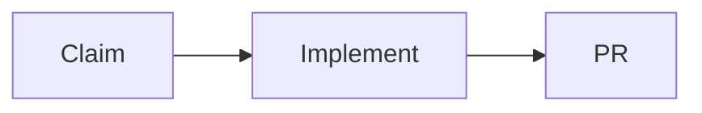

# Workflows

Workflows for working locally with AI coding agents, for both solo and team projects.

This repository collects workflows, skills, hooks, and settings for each agent. Shared rules can be reused across repositories. Each project can add its own commands and requirements.

## Starting point

This workflow is a draft. We will work out who does what, which checks to run, and what to automate together.

## Contents

- [Local development workflow](workflows/local-development.md)
- [Agents and settings](agents/README.md)
- [Skills](skills/README.md)
- [Hooks](hooks/README.md)
- [Solo and team profiles](profiles/README.md)
- [Examples](examples/README.md)

## How we work

1. Describe one local workflow.
2. Decide who does each step and when it is complete.
3. Try the workflow in a real repository.
4. Reuse the parts that work well in other repositories.

## Open questions

- Which coding agents will we support?
- What does Claim mean in practice?
- What should differ between solo and team projects?
- Which steps use skills or hooks, and which are done manually?
