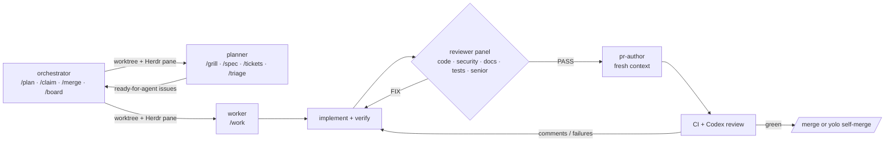

# workflows

Claude Code plugins for high-throughput, low-token, security-conscious development with AI agents. One orchestrator session opens planning sessions that turn ideas into agent-ready issues, and claims those issues into isolated worktree sessions; each worker implements, passes an independent reviewer panel, opens a PR from a fresh context, and drives CI and review comments to green.



## Plugins

| Plugin | What it gives you | Runs where |
| --- | --- | --- |
| [orchestrator](plugins/orchestrator/README.md) | `/plan`, `/claim`, `/yolo-claim`, `/merge`, `/board` (with frontier), `/abandon`, `/herdr` | main checkout, inside [Herdr](https://herdr.dev) |
| [planner](plugins/planner/README.md) | `/grill`, `/spec`, `/tickets`, `/triage`, `/research`, `/prototype`, `/finish`; writes agent-ready issues, never code | each planning worktree |
| [worker](plugins/worker/README.md) | `/work` pipeline, five read-only reviewer agents, fresh-context PR author, CI and review-thread loop, SessionStart hook that loads and assigns the issue | each issue worktree |
| [repo-standards](plugins/repo-standards/README.md) | `/init-repo`, `/adr`, `/docs-check`; templates for CLAUDE.md, architecture.md, ADRs, PR template, settings | any repository |

## Install

Requirements: Claude Code ≥ 2.1.270, `gh` (authenticated), `jq`, git. Herdr for the orchestrator. Optional: `sbx` (Docker Sandboxes) for sandboxed workers, `npx gh-axi` for token-efficient GitHub output, Codex as PR reviewer.

```sh
claude plugin marketplace add CalvinDittkrist/workflows
claude plugin install worker@workflows
claude plugin install planner@workflows
claude plugin install repo-standards@workflows
claude plugin install orchestrator@workflows
```

Per repository, once: run `/repo-standards:init-repo` in the repo. It writes `.claude/settings.json` with the marketplace, enabled plugins, workflow env and a permission allowlist, plus the docs baseline. Commit it; teammates then only run the install commands above.

Skills also work outside Claude Code: `npx skills add CalvinDittkrist/workflows --skill <name>` (Agent Skills format) or `sbx skills add CalvinDittkrist/workflows` for Docker Sandboxes.

## Daily use

```sh
cd my-repo && claude --agent orchestrator       # inside a Herdr pane
```

```text
/orchestrator:plan add offline mode   # worktree + pane + planner: grill, spec, tickets
/orchestrator:plan 123                # triage or shape an existing issue
/orchestrator:claim 123          # worktree + pane + worker for issue 123
/orchestrator:board              # who is doing what, PR and CI state
/orchestrator:merge 45           # squash-merge, remove worktree, workspace and branch
/orchestrator:yolo-claim 124     # worker merges itself when green
/orchestrator:release v1.2.0     # milestone done: promote dev, tag, release notes, close it
```

The worker in each pane reports at decision points only. Talk to it directly in its pane when it asks something.

## Configuration

All knobs are environment variables, set per repository in `.claude/settings.json` → `env` (the template is in `plugins/repo-standards/templates/settings.json`):

| Variable | Default | Meaning |
| --- | --- | --- |
| `WF_BASE_BRANCH` | remote default branch | base for worktrees and PRs |
| `WF_REVIEWERS` | `code,security,docs,tests,senior` | reviewer panel members |
| `WF_REVIEW_ROUNDS` | `3` | max fix-and-re-review rounds |
| `WF_PR_BOT_REVIEWERS` | `chatgpt-codex-connector` | bot logins whose PR review the worker waits for; set to `""` in repositories without a bot reviewer |
| `WF_PR_REVIEW_WAIT` | `600` | seconds to wait for a bot review after checks pass |
| `WF_WORKER_PERMISSION_MODE` | `auto` | permission mode for worker sessions |
| `WF_PLANNER_PERMISSION_MODE` | `auto` | permission mode for planner sessions |
| `WF_CLAUDE_ARGS` | empty | extra flags for every worker and planner (`--model sonnet`, `--plugin-dir …`) |
| `WF_PLANNER_CLAUDE_ARGS`, `WF_WORKER_CLAUDE_ARGS` | empty | extra flags for planner or worker sessions only |
| `WF_MODE`, `WF_ISSUE` | set by `/claim` | per-session mode (`manual`/`yolo`) and issue |
| `WF_PLAN`, `WF_PLAN_ISSUE` | set by `/plan` | per-session plan slug and, when planning an issue, its number |

A worker session takes its model from the first of these that is set:

1. `--model` in `WF_CLAUDE_ARGS` or `WF_WORKER_CLAUDE_ARGS`
2. the `model` field of the session's agent file (`opus` for `worker`, `sonnet` for `orchestrator`)
3. `model` in your Claude Code settings

Subagents resolve separately: an agent file that names a model keeps it — the panel's `docs-reviewer` stays on `sonnet` — and only `model: inherit` follows the session. So `WF_CLAUDE_ARGS="--model sonnet"` pins the worker session per repository, not every reviewer.

Override any agent or skill per repository by placing a file with the same name in `.claude/agents/` or `.claude/skills/`; project definitions win over plugin ones.

## Design

- [Architecture](docs/architecture.md) and [ADRs](docs/adr/README.md)
- [The local workflow, step by step](docs/local-workflow.md)
- [Security and sandboxing](docs/security.md)
- [Token budget: what loads when](docs/token-budget.md)
- [Repository standard](docs/repo-standard.md)

## Develop

```sh
scripts/test.sh                                   # shellcheck, plugin validate --strict, unit tests
claude --plugin-dir plugins/worker                # try a plugin in a session without installing it
scripts/dev-orchestrator.sh                       # orchestrator from the checkout, inside a Herdr pane
```

`dev-orchestrator.sh` points `WF_PLANNER_CLAUDE_ARGS` and `WF_WORKER_CLAUDE_ARGS` at the checkout's plugins, so the sessions the orchestrator opens use them too. Without that (or the plugins installed), a started session exits with `--agent 'planner' not found`; `plan.sh` and `claim.sh` detect that, remove the worktree again and print the fix. The same rollback runs when Herdr refuses the start itself (its error is printed as is) or when the pane is back at a shell prompt. Herdr agent names are derived from the branch and cut to its 32-character limit.

Tests run the real scripts against `gh` and `herdr` shims (`tests/shims/`). Plugins are self-contained; bump `version` in a plugin's manifest and run `scripts/release.sh <plugin> --push` to tag a release.

MIT licensed.
