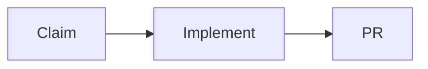

# Local development workflow

Status: Draft. So far, we have agreed on the order: **Claim → Implement → PR**.

## Claim

To define: how to choose and reserve a task, set up a working directory and branch, and gather the context needed.

## Implement

To define: how to work with the agent, make changes, run tests, and check the result locally.

## PR

To define: how to commit, open a pull request, review changes, address feedback, and prepare for merge.

## Questions for each step

- What needs to be ready before we start?
- What does the person do, and what does the agent do?
- Which skills, hooks, and settings do we need?
- How do we know the step is complete?
- What differs between solo and team projects?
